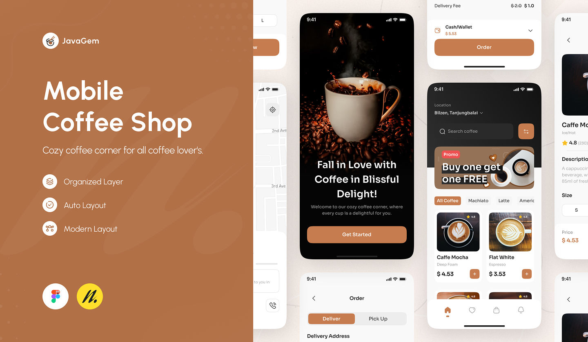

# ☕ BeanBliss - Premium Coffee Shop App

[](https://github.com/NADAASHRAF191/coffee-app)

BeanBliss is a high-end, feature-rich coffee ordering application built with **Flutter**. It provides a seamless and premium user experience for coffee enthusiasts, featuring a modern dark UI and smooth animations.

---

## 🌟 Features

*   **Premium Sleek UI**: A visually stunning dark theme designed for a modern aesthetic.
*   **Hero Animations**: Fluid and professional transitions between screens.
*   **Real-time Search**: Instant product filtering as you type.
*   **Dynamic Categories**: Filter products by type (Espresso, Latte, Macchiato, etc.) with one tap.
*   **Advanced Cart System**: Add, remove, and manage quantities in a persistent shopping bag.
*   **Product Customization**: Select milk types, toppings, and sizes before ordering.
*   **Favorites/Wishlist**: Save your favorite brews for quick access.
*   **Comprehensive Navigation**: Includes Home, Favorites, Bag, and Profile screens.
*   **Premium Onboarding**: Immersive welcome screen to engage users from the start.

---

## 📱 Screenshots

| Welcome Screen | Home View | Product Details | Shopping Bag |
| :---: | :---: | :---: | :---: |
|  |  |  |  |

*(Note: Replace with actual screenshots of your app for a better presentation)*

---

## 🛠️ Built With

*   **Flutter**: For cross-platform UI development.
*   **Dart**: The powerful language behind Flutter.
*   **Clean Code Architecture**: Organized for scalability and maintainability.
*   **Custom Design System**: Bespoke typography and color palettes.

---

## 📌 Description (Arabic)

**تطبيق BeanBliss هو تطبيق متطور لطلب القهوة تم بناؤه باستخدام Flutter. يقدم تجربة مستخدم فاخرة ومتكاملة، حيث يتميز بواجهة داكنة أنيقة وتأثيرات بصرية متقدمة.**

### أهم المميزات:
*   **واجهة مستخدم احترافية:** تصميم عصري وجذاب يركز على الفخامة.
*   **تأثيرات Hero:** حركات انتقالية سلسة تجعل التنقل بين الصفحات تجربة ممتعة.
*   **البحث الفوري:** العثور على مشروبك المفضل بسرعة فائقة.
*   **نظام السلة المتكامل:** إدارة المشتريات والكميات وحساب الإجمالي تلقائياً.
*   **تخصيص الطلب:** اختيار نوع الحليب والإضافات والحجم لكل مشروب.
*   **قائمة المفضلة:** حفظ المشروبات المفضلة للوصول السريع إليها.
*   **شاشة ترحيب بريميوم:** واجهة دخول مبهرة تجذب المستخدمين.

---

## 🚀 Getting Started

1.  **Clone the repository:**
    ```bash
    git clone https://github.com/NADAASHRAF191/coffee-app.git
    ```
2.  **Get dependencies:**
    ```bash
    flutter pub get
    ```
3.  **Run the app:**
    ```bash
    flutter run
    ```

---

## 🌐 Developed By

**NADA ASHRAF**  
[GitHub Profile](https://github.com/NADAASHRAF191)
